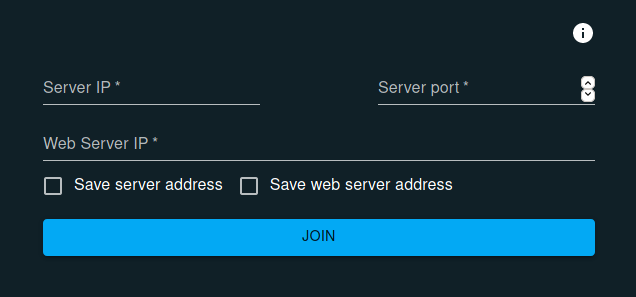

# Chat Client
A simple chat client made with [WebSocket](https://developer.mozilla.org/en-US/docs/Web/API/WebSockets_API?retiredLocale=en) and [React](https://reactjs.org/).

## Index
- [Dependencies](#dependencies)
- [Installation](#installation)
- [Execution](#execution)
- [Binaries]()
- [Related projects](#server-and-web-server)

## Dependencies
- [nodejs](https://nodejs.org/en/) (v. >= 14.17.0, LTS version will be ok)
- npm (v. >= 7.12.13, after you installed nodejs just do ```npm install --global npm``` in case of previous versions)

##### If you are on Linux, I suggest you to use [nvm](https://github.com/nvm-sh/nvm.git)

## Installation
First, you need to download project dependencies with:
```bash
npm install
```

## Execution
To start the application type on your terminal (or command prompt):
```bash
cd ChatClient
npm start
```
This will start a kind of web server listening on ```localhost:3000``` (or whatever)

When you start the application, the first form is for connecting to
the server



More information about these values can be retreived by clicking
to the info button at the top right of the form.

### The server is unavailable
If the application can't connect to the server, you will receive
an alert


### The server is on and the connection has been established
If the application reached the served, it will display a login form


Enter in your credentials (to do the registration you need to use the Chat Web Server) and that's it!

## Binaries
You can find binaries of this app on *Releases* section on Github.

## Server and Web Server
This app acts as a client for these 2 repos:
- [Chat Server](https://github.com/J-Dany/Chat.git)
- [Chat Web Server](https://github.com/J-Dany/ChatWS.git)

###### Made by Daniele Castiglia